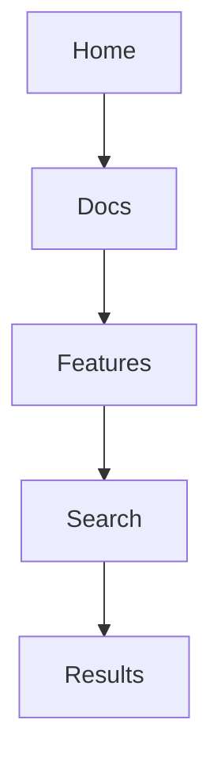

## Overview

Aleksandr Kislitsyn provides a comprehensive suite of tools to help you organize, edit, collaborate on, and navigate your project documentation efficiently. You create structured spaces for all your docs, from quick notes to full API references. Key capabilities include intuitive page organization, rich editing tools, seamless collaboration, and powerful search.

<Columns cols={2}>
  <Card title="Organize Pages" icon="layout" href="#page-organization">
    Structure your content with nested sections and hierarchies.
  </Card>
  <Card title="Edit with MDX" icon="edit-3" href="#content-editing">
    Use Markdown with JSX components for interactive docs.
  </Card>
  <Card title="Collaborate Easily" icon="users" href="#collaboration">
    Share, review, and co-edit in real-time.
  </Card>
  <Card title="Search Smartly" icon="search" href="#search-navigation">
    Find content instantly with full-text search.
  </Card>
</Columns>

## Page and Section Organization

You organize your documentation into pages and sections using a hierarchical structure. Create top-level pages for major topics like "Getting Started" or "API Reference," then nest subsections for deeper dives.

<Steps>
  <Step title="Create a Page" icon="plus">
    Navigate to your space and click "New Page." Enter a title and add YAML frontmatter for metadata.
  </Step>
  <Step title="Nest Sections" icon="folder">
    Drag pages into folders or use sidebar indentation to create hierarchies.
  </Step>
  <Step title="Reorder Content" icon="move">
    Use drag-and-drop in the navigation sidebar to adjust order.
  </Step>
</Steps>

<Callout kind="tip">
  Use consistent naming conventions like "verb-noun" for actions (e.g., "install-package") to keep your structure intuitive.
</Callout>

## Content Editing and Formatting Tools

Edit content directly in the browser with live previews. Aleksandr Kislitsyn supports full MDX, so you combine Markdown with interactive JSX components for richer docs.

<Tabs>
  <Tab title="Basic Formatting" icon="type">
    Use standard Markdown for text:

````markdown
# Heading (avoid in body)

**Bold** and _italic_ text.

`Inline code` for variables like `{API_KEY}`.
````
  </Tab>
  <Tab title="Code Examples" icon="code">
    Add highlighted code blocks:

````javascript
// Realistic API call example
const response = await fetch('https://api.example.com/users', {
  headers: { Authorization: `Bearer ${YOUR_TOKEN}` }
});
const users = await response.json();
console.log(users);
````
  </Tab>
  <Tab title="Components" icon="layers">
    Embed components like `<Callout>` for notices.
  </Tab>
</Tabs>

## Collaboration and Sharing Features

Invite team members to collaborate in real-time. You assign roles like Editor or Viewer, track changes, and share public links.

<CodeGroup tabs="Invite,Share">
```javascript
// Generate invite link via API
const inviteUrl = await api.post('/spaces/{spaceId}/invites', {
  email: 'team@company.com',
  role: 'editor'
});
```
```bash
# CLI command for sharing
ak-docs share --space my-project --public --token YOUR_TOKEN
```
</CodeGroup>

<Expandable title="Advanced Permissions" default-open="false">
  Set granular permissions per section:

  | Role     | Edit Pages | Publish | Manage Users |
  |----------|------------|---------|--------------|
  | Viewer   | No         | No      | No           |
  | Editor   | Yes        | No      | No           |
  | Admin    | Yes        | Yes     | Yes          |
</Expandable>

## Search and Navigation Functionalities

Navigate effortlessly with a global search bar that indexes all content. You search by keywords, filter by section, or use breadcrumbs for hierarchy.



<Callout kind="info">
  Pro tip: Pin frequently used pages to your dashboard for one-click access.
</Callout>

These core features empower you to build professional documentation spaces tailored to your projects. Explore [page organization](#page-organization) first to get started.